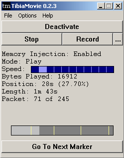
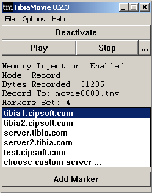

# TibiaMovie

## Features

- Record and Play movies from Tibia using .tmv movie format.
- Speed bar allows you to speed up movies for quick perusal.
- Various statistics displayed in Playback/Record mode, such as: bytes played/recorded, current position and total duration of movie (playback), current/total amount of packets (playback), number of markers set (record).
- "Frame by frame" playback allows you to play back a single packet at a time. This allows for precise screenshotting, or figuring out what happened through all that spam.
- Automatically names your movies when recording if you don't set a name. movie0001.tmv, movie0002.tmv, etc.
- Choose a different login server, or even use a custom one.
- Add markers when recording to set "waypoints" in your movie. Anyone that plays your movie will see these markers, and be able to automatically fast forward to them by simply clicking the "Go To Next Marker" button.
- When you record a movie, the version of Tibia it was recorded in is included in the .tmv file. When playing back, you can see what version each movie is recorded in. This makes it easy to see if a movie is going to work, or if you need to change client versions first.
- All movies are automatically compressed, reducing the movie size to ~30% of the original. This makes it easier to upload to sites that have upload/timeout/bandwidth restrictions, without having to zip/rar the movie.

## Download

[Download](http://prdownloads.sourceforge.net/tibiamovie/TibiaMovie-0.3.3.exe?download) the latest version of TibiaMovie (**0.3.3**).

Don't trust .exe's? I don't blame you. Download the [Source Code](http://prdownloads.sourceforge.net/tibiamovie/TibiaMovie-0.3.3-src.zip?download) for the program, check the source, then compile it yourself!

Releasing the source code does come with negatives, however. Since anyone can make their own version of TibiaMovie, they can add trojans/etc and try to release it themselves. To be safe, **ONLY** get TibiaMovie from this website.

We are now hosted on [SourceForge](http://sourceforge.net/)! See our [Project](http://sourceforge.net/projects/tibiamovie/) page.

## Screenshots

Playback:

Record:

## Documentation

Currently, all the available documentation for TibiaMovie is included with TibiaMovie in the _readme.txt_ file. Read it carefully before running TibiaMovie. Alternatively, you can [view](http://cvs.sourceforge.net/viewcvs.py/*checkout*/tibiamovie/tibiamovie/readme.txt?rev=1.22) the _readme.txt_ online in CVS.

## Example Movies

Currently none.

## Version History

**July 27 2005 (0.3.3):**
- Update TibiaMovie's compression library, zlib, to version 1.2.3\. Old version (1.2.1) had a security flaw, see [http://www.zlib.net/](http://www.zlib.net/) for details.

**June 9 2005 (0.3.2):**
- Fixed a problem with the Tibia client version not being stored properly in .tmv's when using the search method.

**June 8 2005 (0.3.1):**
- Added support for Tibia 7.41 and future versions.

**February 7 2005 (0.3.0):**
- Added ability to merge multiple movies into a single movie, as a standalone option.

**January 13 2005 (0.2.9):**
- Fixed bug where you couldn't record if in a waiting list.

**December 15 2004 (0.2.8):**
- Added support for Tibia 7.4.

**December 14 2004 (0.2.7):**
- Added support for Tibia 7.36.

**December 11 2004 (0.2.6):**
- Updated for new Tibia 7.35 client.
- Fixed a bug that, when fast forwarding to the next marker, if no marker was found, it would still fast forward on the next movie if any (snack).

**November 29 2004 (0.2.5):**
- Allow playback and recording of old Tibia versions, specifically, Tibia 7.1, using the "Old Tibia Client" option in the Options menu.
- Fixed a bug when choosing a custom server.

**November 22 2004 (0.2.4):**
- Fixed a bug that didn't allow various people to record properly. Hopefully everyone can record equally now!

**November 1 2004 (0.2.3):**
- Fixed a problem with older Tibia clients not being able to be activated.
- Added an option to only show movies that are compatible with the active version of Tibia. This won't make much difference now, but will be handy in the future.
- The number of premium days left is the now the number of movies shown in playback mode, if it shows 12 premium days left, there's 12 movies to choose from.
- Added a menu for the above option, and an about dialog box, etc.

**October 1 2004 (0.2.2):**
- Buttons now use the XP theme if you're using the XP theme.
- When you click on "Go To Next Marker", the button is disabled until the marker is reached, or if you change the speed.
- TibiaMovie's version is now displayed in the title bar.
- If you've been playing a movie and you stop playback, then start playback, no remnants of the old movie playback will be present now.
- Added a helper message to click on Play/Record when in Mode: None.
- In playback mode, the current/amount of packets is now displayed.
- When playing back at high speed, to avoid flicker in the TibiaMovie window, it will now only refresh the window 5 times a second instead of for every single packet.
- The list of movies for playback is now sorted alphabetically.
- Re-enabled the TibiaMovie welcome packet message. This still won't work under certain circumstances. If this causes bugs, let me know and I'll just disable it for good.

**September 30 2004 (0.2.1):**
- Added support for "frame by frame" playback by clicking the ">" when in the paused position.
- Updated readme.txt.

**September 13 2004 (0.2.0):**
- Add a progress bar in playback mode.
- Show markers on progress bar when playing a movie.
- Changed colour of speed bar pointer when in pause mode.
- Changed default font to a "lighter" (and better looking) fixed-width font.
- Fixed a bug where the record listening sockets weren't being deleted properly in some instances.
- Fixed a bug where the "Add Marker" button wasn't being removed in some instances.

**September 12 2004 (0.1.9):**
- Fix some silly bugs that were introduced in 0.1.8.

**September 12 2004 (0.1.8):**
- Add support for movie compression. All new movies will be compressed using zlib, which will greatly reduce movie sizes. For example, a movie that was 3.2 MB is now 605 KB, a reduction to 20% of the original size. Old movies will still work as normal.

**August 13 2004 (0.1.7):**
- Update for new Tibia version 7.3.

**July 30 2004 (0.1.6):**
- Added the ability to use a custom login server for recording.
- Fixed yet another problem with the first packet and sending our own greeting message.

**July 23 2004 (0.1.5):**
- Updated TibiaMovie to reflect new Tibia 7.27 version.
- No longer disconnect from Tibia when you stop recording, instead, it just stops recording, then the button changes to "Disconnect" if you want to forcefully disconnect.
- Fixed a problem with the "last packet delay" not sending a CHUNK header.
- When playing back, the information now updates once a second, instead of freezing while waiting Sleep()ing in a delayed packet, so if nothing happens for 10 seconds, it won't jump from, say, 40s to 50s, it will update once a second like it should.
- Only show disconnect if actually connected to the server.
- Only show speed bar when in play mode.

**July 10 2004 (0.1.4):**
- Nothing major was changed, but this release denotes when the source code for the program was released.

**July 09 2004 (0.1.3):**
- Added basic support for playing TibiCam .rec files.

**July 04 2004 (0.1.2):**
- Changed TibiaMovie dimensions so, when recording, all the fields were viewable (Markers Set wasn't being displayed)
- Markers Set field now only shown when above 0.
- Should no longer improperly record a movie when the server fails to log in (ie. Too many players, server going down, other status messages).

**July 01 2004 (0.1.1):**
- First public release of TibiaMovie.
